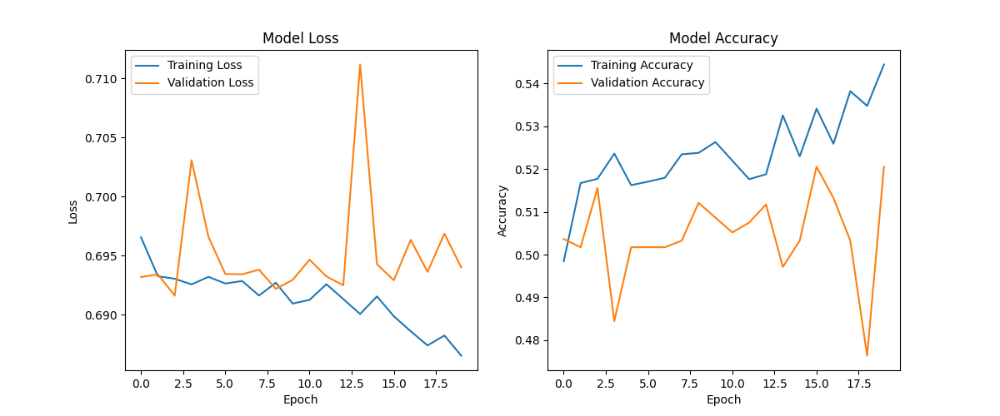

# 📈 BTC/USDT Price Movement Classification

A deep learning-based time series classification project designed to predict short-term BTC/USDT price direction using technical indicators and a hybrid CNN-LSTM architecture.

---

## 📌 Objective

This project aims to classify whether the price of BTC/USDT will rise or fall within the next 6 hours using historical candlestick data and derived technical indicators. The task is framed as a binary classification problem.

---

## 🧠 Approach

1. **Data Preparation**  

   Historical OHLCV (Open, High, Low, Close, Volume) data for the BTC/USDT pair is collected from the Binance exchange using the `ccxt` library. The dataset spans the **last 12 months** with **30-minute intervals**, resulting in approximately 17,000+ data points.

   To define the classification target:

   * A **6-hour forecast horizon**  is used (i.e., 12 candles ahead with 30-minute intervals). This window was selected to strike a balance between short-term reactivity and signal reliability—very short horizons (e.g., 1–2 candles) tend to produce highly noisy and unreliable labels due to rapid price fluctuations and market noise.
   * The target label is set as:

   * **1** if the closing price after 6 hours is higher than the current closing price
   * **0** otherwise

   This transforms the time series forecasting problem into a **binary classification** task, enabling the model to learn directional price movement patterns rather than exact price values.

   Missing or incomplete target rows caused by the forward shift are removed to ensure clean labeling.

2. **Feature Engineering**  
   A rich set of technical indicators is generated, including:
   - Moving Averages (SMA, EMA)
   - Momentum Indicators (RSI, MACD, Stochastic, Williams %R)
   - Volume Indicators (ADI)
   - Oscillators (CCI)
   
   The selection of these indicators is based on the study *“Stock Price Movements Classification Using Machine and Deep Learning Techniques – The Case Study of Indian Stock Market”* ([ResearchGate](https://www.researchgate.net/publication/333086170_Stock_Price_Movements_Classification_Using_Machine_and_Deep_Learning_Techniques-The_Case_Study_of_Indian_Stock_Market)).

   Point-biserial correlation is computed to evaluate the predictive power of each feature with respect to the binary target.
   

3. **Model Architecture**  
   A hybrid model combining CNN and LSTM layers is implemented to leverage both local pattern extraction and long-term temporal dependencies in the data:

      * **Conv1D layers** extract local features and short-term patterns from the sequential input.
      * **LSTM layer** captures long-term dependencies and temporal dynamics crucial for time series prediction.
      * **Dropout layers** are used for regularization to prevent overfitting.
      * **Dense layers** serve as the final classification layers, outputting the binary prediction (price Up or Down).

   The model is compiled using the **Adam optimizer** with a learning rate of 0.001, chosen for its adaptive learning capability and efficient convergence.

   For training evaluation, multiple metrics are tracked:

      * **Accuracy** to measure overall correctness,
      * **Precision** and **Recall** to evaluate performance on positive class detection,
      * **AUC (Area Under the ROC Curve)** to provide a robust measure of classification quality across thresholds.

   This combination of architecture and metrics aims to maximize predictive performance on noisy financial data while providing detailed insight into model behavior.

4. **Training Strategy**  
   - The dataset is split into Train (70%), Validation (15%), and Test (15%) sets.
   - Features are standardized using `StandardScaler` instead of Min-Max scaling because financial data, especially price, does not have a fixed maximum value and can potentially grow indefinitely. This avoids issues with scaling future unseen high values outside the original range.
   - `TimeseriesGenerator` is used to provide sequential inputs.
   - Learning rate scheduling and early stopping are applied to optimize training.

---
## 📉 Training Performance
Below is the training vs. validation loss plot:



## 📊 Evaluation

Model performance is assessed using:
- Accuracy
- F1 Score
- Confusion Matrix
- Precision & Recall
- ROC AUC

**Validation Results**  
```yaml 
- Accuracy: ~51.21%  
- F1 Score: ~0.59
- AUC: ~0.53
- Precision: ~0.51
- Recall: ~0.98
```

**Test Results**  
```yaml 
- Accuracy: ~52.0%
- F1 Score: ~0.57
- Loss : ~0.69
```

```yaml
Classification Report:
              precision    recall  f1-score   support

           0       0.48      0.44      0.46      1195
           1       0.55      0.59      0.57      1411

    accuracy                           0.52      2606
   macro avg       0.52      0.52      0.51      2606
weighted avg       0.52      0.52      0.52      2606

```

The model shows a modest improvement over random guessing, with slightly better performance on upward movement prediction.

---
## 🌲 Project Structure
```yaml

├── main.py # Main script to run the model training and evaluation
├── environment.yml # Conda environment specification for reproducibility
├── models/ # Pretrained and saved model files
├── notebooks/
│           ├── btc-price-movement-classification.ipynb # Core Jupyter notebook for exploration & experimentation
│           └── tools/
│                   └── LearningPlot.py # Custom utility for visualization during training
└── src/
        ├── data_utils.py # Data fetching and preprocessing utilities
        ├── feature_engineering.py # Technical indicator calculation and feature engineering modules
        └── model.py # Model architectures, training, and evaluation scripts

```
---
## ⚙️ Installation & Setup

Follow the steps below to set up and run the project on your local machine.

### 1. Clone the Repository

```bash
git clone https://github.com/MuhammetAliVarlik/BTC-USDT-Price-Movement-Classification.git
cd BTC-USDT-Price-Movement-Classification
```

### 2. Create the Conda Environment
- The environment includes TensorFlow, NumPy, scikit-learn, pandas, matplotlib, seaborn, and other dependencies.

```bash
conda env create -f environment.yml
conda activate btc-prediction
```
### 3. Run the Main Script
- Once the environment is active, execute the main pipeline:

```bash
python main.py
```

## 🔍 Overview

This project applies a CNN-LSTM hybrid model to predict Bitcoin price movements based on historical OHLCV data and technical indicators. 

For future improvements, incorporating additional external data sources such as sentiment analysis or macroeconomic indicators could provide richer context and potentially enhance prediction accuracy. 

Experimenting with different input sequence lengths and window sizes might help the model better capture relevant temporal patterns. Further tuning of hyperparameters and exploring alternative architectures like Transformers or attention mechanisms could improve model performance.

These potential enhancements offer promising directions to build upon the current solution and adapt to evolving market dynamics.

